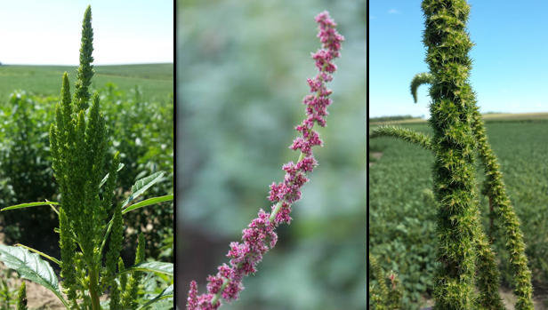

```{r include=FALSE}
library(tidyverse)
library(leaflet)
library(leaflet.providers)
library(leaflet.extras)
library(icons)
library(tidyUSDA)
library(plotly)
```


```{r setup, include=FALSE}
options(htmltools.dir.version = FALSE)
knitr::opts_chunk$set(
  fig.width=9, fig.height=3.5, fig.retina=3,
  out.width = "100%",
  cache = FALSE,
  echo = FALSE,
  message = FALSE, 
  warning = FALSE,
  fig.show = TRUE,
  hiline = TRUE
)
```

```{r xaringan-themer, include=FALSE, warning=FALSE}
library(xaringanthemer)
style_duo_accent(
  primary_color = "#AB0520",
  secondary_color = "#0C234B",
  inverse_header_color = "#EF4056"
)
```

```{r meta, echo=FALSE}
library(metathis)
meta() %>%
  meta_general(
    description = "Oliveira's seminar at the University of Arizona",
    generator = "xaringan and remark.js"
  ) %>% 
  meta_name("github-repo" = "maxwel/talks") %>% 
  meta_social(
    title = "Developing an Extension and Applied Research Weed Science Program for Arizona",
    url = "https://arizona-talk.netlify.app/",
    image = "https://arizona-talk.netlify.app/images/social-card.png",
    image_alt = "Uma planta daninha em pastagem",
    og_type = "website",
    twitter_card_type = "summary_large_image",
    twitter_creator = "@maxwelco"
    ) %>% 
   include_meta()
```

```{r features, include=FALSE, warning=FALSE}
xaringanExtra::use_search(show_icon = TRUE,
                          position = "top-left")
xaringanExtra::use_webcam()
#xaringanExtra::use_freezeframe()
xaringanExtra::use_tile_view() # use letter O
xaringanExtra::use_share_again()
xaringanExtra::use_scribble() # use letter S
xaringanExtra::use_fit_screen()
xaringanExtra::use_broadcast() # use P
```


background-image: url(images/cody.jpg)
background-position: right
background-size: contain


## Outline


- Background

- Research experiences

- Future research and extension goals in Arizona

---


class: middle, center

## Maxwel Coura Oliveira


[`r icon_style(fontawesome("github"), style = "solid")` @maxwelco](https://github.com/maxwelco)  
[`r icon_style(fontawesome("twitter"), style = "solid")` @maxwelco](https://twitter.com/maxwelco)  
[`r icon_style(fontawesome("link"), style = "solid")` maxweeds.rbind.io](https://maxweeds.rbind.io)


---

<center>


</center>

**Mission:** provide unbiased, research-based information to the people to ultimately improve their lives

**Challenges:** 
  - Losing our research base
  
  - Sharing our unbiased, research-based information in the places where customers are receiving information
  


---


<center>


</center>


---

class: right
background-image: url(images/arizona.jpeg)
background-position: left
background-size: contain


## Think about what this means<br> for how **Teaching**, **Research**, and <br>**Extension** continue to serve the<br> people of Arizona and beyond


---


background-image: url(images/br_map.jpg)
background-position: right
background-size: contain


## Educational background

- Universidade Federal dos Vales do Jequitinhonha e Mucuri
    
    - BSc in Agronomy 
    
    - MSc in Crop Science (Weed Science)

- University of Nebraska-Lincoln

    - PhD in Weed Science

---

## Relevant professional experience

.pull-left[
- The Ohio Program
    
  - Long's Family Farm (MI)
    
  - Intergrow greenhouses (NY)


- Timac Agro Brasil

]


.pull-right[

- University of Wisconsin-Madison

  - Postdoc/Research Associate
    


- Universidade do Oeste Paulista

  - Assistant Professor

]

<br>
<center>

</center>


---

class: inverse
background-image: url(images/master.png)
background-position: right
background-size: contain

## Master's research

- Modeling crop-weed competition

- Additive design

- Data analysis


---

class: inverse
## PhD research


- Evolution of HPPD-inhibitor herbicide resistance in a waterhemp (*Amatanthus tuberculatus* var. *rudis*) population from Nebraska

.pull-left[

]


.pull-right[

]

---

background-image: url(images/sorghum.jpg)
background-position: right
background-size: contain


## HPPD-inhibitor herbicides

- HPPD (4-hydroxyphenylpyruvate dioxygenase)

- Pigment inhibitors (group #27)

- Commonly applied to corn

- Systemic herbicide

- Sensistive plants show bleaching symptons


---

## The dioecious *Amaranthus* species


.pull-left[
- A plant is either **F**emale or **M**ale

- Rapidly evolves resistance to herbicides

- Two of the most troublesome weed species in the US

- Waterhemp -> Midwest

- Palmer amaranth (*Amaranthus palmeri*) -> South
]


.pull-right[
.pull-left[

]
.pull-right[

]
]

---

## Concerns: HPPD-resistance in *Amaranthus* species

- HPPD-resistance (R) in waterhemp and Palmer amaranth biotypes in corn fields across the US Midwest

- Grower reported failure to control waterhemp in Nebraska (Platte Country, 2011)

- **Resistance:** Target site resistance (TSR) or Non-target site resistance (NTSR)

- Gene flow amongst *Amaranthus* species


.pull-left[

]

.pull-right[

]

---

## Confirmation of HPPD-R in Nebraska


.pull-left[

]

.pull-right[

]

---
exclude: true
## We learned that

.pull-left[

]

.pull-right[
- Confirmed resistance to mesotrione, tembotrione, and topramezone

- Herbicide programs (PRE, POST, and PRE fb POST) provided effective (>90%) HPPD-R waterhemp control
]


---

## What is the mechanism of HPPD-resistance?

<center>

</center>


---
exclude: true
## Background

<center>

</center>


---

## What is the mechanism of HPPD-resistance

.pull-left[


]

.pull-right[


]

---
exclude: true
## We learned that 

.pull-left[
- Confirmed enhanced **metabolism**-based mesotrione, tembotrione, and topramezone resistance via P450 enzymes in HPPD-R waterhemp.

- POST-application of P450 inhibitors with tembotrione showed a potential for **reversing** HPPD-R waterhemp to a susceptible phenotype.
]

.pull-right[

]


---

## How is waterhemp evolving HPPD-resistance?

- Inheritance of mesotrione resistance in waterhemp

- Multiple crosses (F<sub>1</sub>, F<sub>2</sub>, BS<sub>S</sub>)


.pull-left[

]


.pull-right[

]


---
exclude: true
## Significance

.pull-left[
- Inheritance studies can **improve** our knowledge of genetic structure of weed populations under herbicide selection

- Evidence from inheritance studies can also aid in creating appropriate herbicide resistance **simulation models**

- Improve herbicide recommendations
]

.pull-right[

]

---

## Degree of dominance 

.pull-left[

]


.pull-right[

]


---
exclude: true
## One locus


<center>

</center>


---

## Segregation

<center>

</center>


---
exclude: true
## Waterhemp phenotype

<center>

</center>

---
exclude: true
## Segregation

<center>

</center>


---
exclude: true
## We learned that

.pull-left[
- There is a lack of dominance in the HPPD-R waterhemp and high degree of genetic **complexity** within population (dioecius species)

- The reciprocal cross in the F<sub>1</sub> families exhibited **nuclear** inheritance (R×S and S×R)


- Mesotrione resistance is likely mediated by multiple genes, with confer herbicide detoxification via P450s
]

.pull-right[
<center>

</center>
]

---

background-image: url(images/dronef.png)
background-position: right
background-size: contain

## Pollen-mediated gene flow

.pull-left[
<center>



</center>
]


---
exclude: true
## Significance


.pull-left[
- **Understand** the role of metabolism-based pollen dispersal in *Amaranthus* species

- *Amaranthus* species are co-existing in the same location, increasing chances of **hybridization** among them

- Herbicide resistance management strategies
]

.pull-right[
<center>

</center>
]


---

## Field research

.pull-left[
<center>


</center>


]

.pull-right[
<center>


</center>

]


---

## Aerial view

<center>

</center>


---

## Mesotrione resistance as a marker


.pull-left[

F<sub>1</sub> HPPD-**R** to HPPD-**S** waterhemp

<center>

]

.pull-right[

F<sub>1</sub> HPPD-**R** waterhemp to HPPD-**S** Palmer amaranth


</center>
]


---
exclude: true
## Intraspecific hybridization

HPPD-**R** &#x2192; HPPD-**S** waterhemp


.pull-left[

]

.pull-right[

]


---


## Internal transcribed spacer of the ribosomal coding region

<center>

</center>

.pull-left[
- Double mutation distinct Palmer amaranth from 8 *Amaranthus* species

- KASP assays

- **HEX** and **FAM** fluorescent channels
]

.pull-left[

<center>

</center>
]


---

## Interspecific hybridization


HPPD-**R** waterhemp &#x2192; HPPD-**S** Palmer amaranth


<center>

</center>


**Hybrid:** 1 out 1000 plants


---
exclude: true
## We learned that


.pull-left[
- Two species could **hybridize** and transfer metabolism-based resistance alleles for mesotrione resistance

- Even at low frenquencies, gene flow can have important evolutionary consequences in weedy *Amaranthus* species

- **Metabolism**-based herbicide resistance in *Amaranthus* species is here to stay
]


.pull-right[
<center>

</center>
]


---

## University of Nebraska-Lincoln

.pull-left[
<center>

</center>
]

.pull-right[
<center>

</center>
]


---

class: inverse
## University of Wisconsin-Madison

.pull-left[
- Experienced and helped with the established of a new *Research* and *Extension* program

- Herbicide evaluation program

- Support Research and Extension staff

- Seven graduate students/visiting students

- NCWSS and WSSA's meetings/weeds contest


<center>

</center>
]

.pull-right[
<center>

</center>

]

---

## University of Wisconsin-Madison

.pull-left[

]

.pull-right[
- Cultural and chemical weed control in corn and soybeans

- Herbicide weed resistance

- Cover crops

- Dicamba/2,4-D drift

- Soil residual herbicides

- Weed management in hemp
    
- Plant hormones

]

---


background-image: url(images/max3.jpeg)
background-position: right
background-size: contain

## University of Wisconsin-Madison


- Workshops

- Grants

  - Wisconsin corn promotion board
      - Weed management
    
  - UW Division of Extension
      - Hemp
        
  - North Central Research Program
      - Not funded
  
  - Industry


---

background-image: url(images/max.jpeg)
background-position: right
background-size: contain

## University of Wisconsin-Madison


---

background-image: url(images/fieldd.png)
background-position: right
background-size: contain

## University of Wisconsin-Madison


---

background-image: url(images/professor.jpg)
background-position: right
background-size: contain

## Universidade do Oeste Paulista

- Assistant Professor

  - Teaching Weed Management
  - Teaching R programming
  - Teaching Wheat cropping systems
  
- Research

  - Graduate and undergraduate student

---


## Universidade do Oeste Paulista

.pull-left[

]

.pull-right[

]


---

background-image: url(https://pbs.twimg.com/media/D-X2bddXsAAWLE7?format=jpg&name=medium)
background-position: left
background-size: contain

.pull-right[

## RStudio instructor

- R programming

- Data analysis

- Data viz

- Blogs

- Shiny apps


]


---

class: inverse middle center


### Assistant Extension Specialist and Professor in Weed Science


---

background-image: url(images/pecan.jpeg)
background-position: right
background-size: contain

## Arizona

- Agriculture of $23 billion<sup>1</sup>

- Water in the desert

- Fertile soil

- Variety of crops
  
  - Cotton
  - Small grains 
  - Citrus
  - Orchards
  - Vegetables
  - Other specialty crops


.footnote[<sup>1</sup>Arizona Department of Agriculture]

---

## Arizona


```{r echo = FALSE, fig.width=7, fig.height=7, fig.retina=3}
leaflet() %>%
  addTiles() %>%  
  setView(lng = -111.0937, lat = 34.0489, zoom = 6.5) %>% 
  addProviderTiles(providers$Esri.WorldImagery, group = "Esri World Imagery") %>% 
 addLayersControl(baseGroups = c("OSM", "Esri World Imagery"), 
                   overlayGroups = c("SESYNC"),
                   options = layersControlOptions(collapsed = FALSE))
```


---

## Herbicide resistance

<center>

</center>

---

## Herbicide site(s) of action

<center>

</center>


---

## The broken system

<center>

</center>


- After decades, herbicide weed resistance is still a major challenge in the US agriculture

---

## Challenge

.pull-left[

]

.pull-right[
- Weed management: **heavily** based on herbicides

- Herbicide weed resistance is evolution in action

- **Integrated weed management** is no longer a nice idea
]

---

background-image: url(images/identity.png)
background-position: right
background-size: contain


## Create an identity

- Data analytics

- Using big data to understand trends and <br>associations between social (human) <br>behavior and decision making

- Unmanned aerial vehicles 

- Robotics

- Weed ID

- **Arizona:** A hotbed for tech

---

## Focus

<center>

</center>


---

## The modified feedback technology transfer model (FAO)


<center>

</center>


FSR/E = farming system research/extension - **"on farm"**<br>
**"on farm"**: small plot at grower's field addressing their needs


---

## Team work


.pull-left[
- Research technologists

- Undergraduate students

- Graduate students

- Postdoctoral research associates

- Visiting scientists


]

.pull-right[


]


---

## Collaborations


.pull-left[


- Extension educators

- Faculty

- Conventional and organic growers

- Stakeholders

- Crop protection industry

- USDA
]

.pull-right[


]


---

## Collaborations

.pull-left[

<center>


<br><br><br>


<br><br><br>


</center>

]

.pull-right[


<br><br><br>


]


---

## Funding

.pull-left[

<center>


<br>


</center>
]


.pull-right[
<center>


<br>

</center>
]


<center>

</center>


---

## Publications

<center>


</center>


---

name: goodbye
class: right, middle, blue


# Thank you!

#### You can find me at...

[`r icon_style(fontawesome("github"), style = "solid")` @maxwelco](https://github.com/maxwelco)  
[`r icon_style(fontawesome("twitter"), style = "solid")` @maxwelco](https://twitter.com/maxwelco)  
[`r icon_style(fontawesome("link"), style = "solid")` maxweeds.rbind.io](https://maxweeds.rbind.io)  
[`r icon_style(fontawesome("envelope-square"), style = "solid")` maxwelco@gmail.com](mailto:maxwelco@gmail.com)


