```{r setup, include=FALSE}
options(htmltools.dir.version = FALSE)
knitr::opts_chunk$set(
  fig.width=9, fig.height=3.5, fig.retina=3,
  out.width = "100%",
  cache = FALSE,
  echo = TRUE,
  message = FALSE, 
  warning = FALSE,
  fig.show = TRUE,
  hiline = TRUE
)
```

```{r xaringan-themer, include=FALSE, warning=FALSE}
library(xaringanthemer)
style_duo_accent(
  primary_color = "#4B0082",
  secondary_color = "#e59400",
  inverse_header_color = "#FFFFFF"
)
```


```{r features, include=FALSE, warning=FALSE}
xaringanExtra::use_search(show_icon = TRUE,
                          position = "top-left")
xaringanExtra::use_webcam()
#xaringanExtra::use_freezeframe()
xaringanExtra::use_tile_view() # use letter O
xaringanExtra::use_share_again()
xaringanExtra::use_scribble() # use letter S
xaringanExtra::use_fit_screen()
xaringanExtra::use_broadcast() # use P
```


class: middle, center

## Maxwel Coura Oliveira


[`r icon::fa("github")` @maxwelco](https://github.com/maxwelco)  
[`r icon::fa("twitter")` @maxwelco](https://twitter.com/maxwelco)  
[`r icon::fa("link")` maxweeds.rbind.io](https://maxweeds.rbind.io)


---

## Aula 

.pull-left[
- Processo de identificação de problemas no campo

    - Personalidade
    
    - Identificando o probelma

- Foco em herbicidas

- Casos de estudo

- Importante a participação

]

.pull-right[


]

???

Falar sobre o weeds contest. Sobre a importância de seguir esses passos para ter sucesso na solução dos problemas no campo.


---

class: top left
background-image: url(https://i2-prod.dailyrecord.co.uk/incoming/article918217.ece/ALTERNATES/s615b/ronaldo-image-2-85692791.jpg)
background-position: right
background-size: contain

## Personalidade

.pull-left[

- Aperto de mão


- Confiança / Olhar nos olhos


- Questionar / Escutar


- Communicação


- Fazer a pessoa se sentir confortável

]


???

Principalmente a confiança. Conversar de igual para igual.


---
class: top left
background-image: url(https://i.pinimg.com/originals/04/17/8f/04178f97b059059327eb992387febe22.jpg)
background-position: left
background-size: contain

.pull-right[

## Credenciais

- Quem é você?


- O que você faz?

    - Professor
    
    - Agrônomo
    
    - Consultor
]

???

Ter credenciais é muito importante. Um produtor rural não vai dar ouvidos a qualquer pessoa. 


---
class: top left
background-image: url(images/question.jpg)
background-position: right
background-size: cover

## Perguntas

???

Extremamente importante. Inicie do passado, seguindo uma ordem cronológica. Dar alguns exemplos.


---
class: top left
background-image: url(images/agronomo.jpg)
background-position: right
background-size: contain


## Agronomia

- Conhecimento agrônomico

- Saber as técnicas de produção

- Lavouras etc

???

Saber do que ta falando. Conhecer de agronomia, lavouras é muito importante. Ter as técnicas da aula de hoje ajuda mas não resolve.

---

## Identificar

<center>
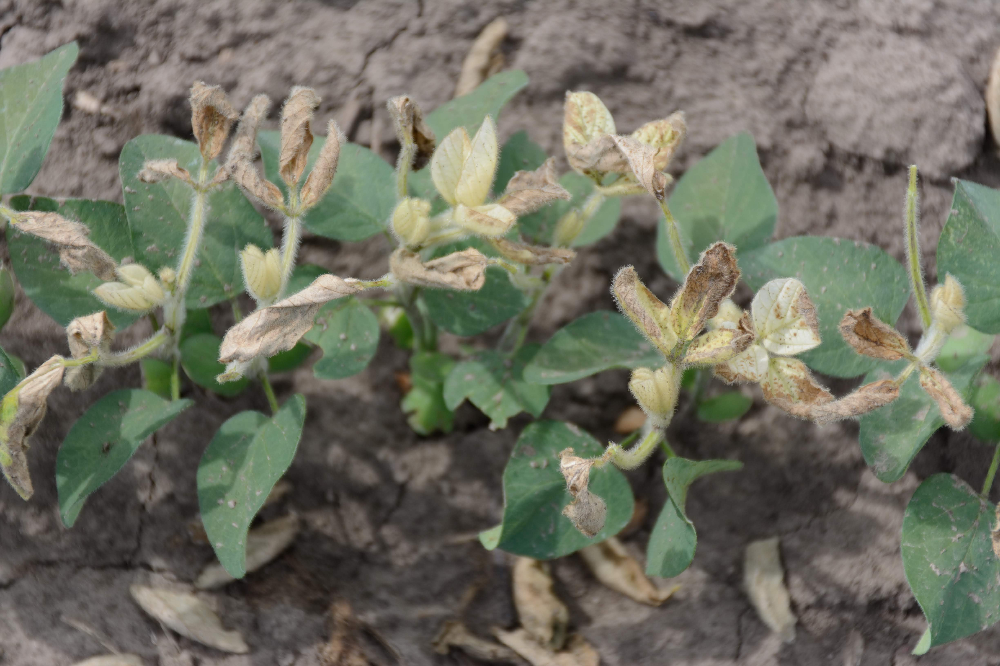
</center>


???

Saber solucionar o problema. Isso vem da experiência e/ou rede de contatos. Conhecer quem sabe do problema.

---

class: top center
background-image: url(images/recommendation.jpg)
background-position: center
background-size: cover

## Recomendação

???

Importante recomendar para a atual situação e para o futuro. Muito importante o futuro.


---

class: inverse center middle

## Um problema no campo


---
class: top left 
background-image: url(https://cropwatch.unl.edu/2017-CW-News/2017-images/weeds/corn-volunteer-glyphosate-resistant.jpg) 
background-position: right
background-size: contain


## Descrição

.pull-left[
Milho voluntário em uma lavoura de milho Roundup Ready (RR) não foi contrado com a aplicação de glifosato.
]

???

Perguntar se eles sabem o que é o milho voluntário

---


## Descrição

> O milho tem atualmente 25 cm de altura e pulverizado com 1,5 L ha<sup>-1</sup> de Zapp QI em torno de 10 dias atras. A maioria das plantas de milho voluntário pode ser encontrada na borda de uma parte da lavoura. O produtor disse que sempre plantou milho verde (sem traços genéticos) no passado mas esse ano preferiu usar o milho RR que muitos produtores estavam usando.

???

Perguntar se eles sabem o que é o Zapp QI

---

## Descrição

> .gray[O milho tem atualmente 25 cm de altura e pulverizado com] **1,5 L ha<sup>-1</sup> de Zapp QI em torno de 10 dias atras.** .gray[A maioria das plantas de milho voluntário pode ser encontrada na borda de uma parte da lavoura. O produtor disse que sempre plantou milho verde (sem traços genéticos) no passado mas esse ano preferiu usar o milho RR que muitos produtores estavam usando.]


<style>
.gray {
color: grey;
}
</style>

---

## Descrição

> .gray[O milho tem atualmente 25 cm de altura e pulverizado com 1,5 L ha<sup>-1</sup> de Zapp QI em torno de 10 dias atras.] **A maioria das plantas de milho voluntário pode ser encontrada na borda de uma parte da lavoura.** .gray[O produtor disse que sempre plantou milho verde (sem traços genéticos) no passado mas esse ano preferiu usar o milho RR que muitos produtores estavam usando.]


O fato de ter mais milho voluntário em uma borda da lavoura deve fazer você pensar o que aconteceu naquele lado.


---

## Descrição

> .gray[O milho tem atualmente 25 cm de altura e pulverizado com 1,5 L ha<sup>-1</sup> de Zapp QI em torno de 10 dias atras. A maioria das plantas de milho voluntário pode ser encontrada na borda de uma parte da lavoura.] **O produtor disse que sempre plantou milho verde (sem traços genéticos) no passado** .gray[mas esse ano preferiu usar o milho RR que muitos produtores estavam usando.]


Esse tipo não é o mais comum de milho voluntário, por quê?


---
class: top left
background-image: url(images/corn.jpg)
background-position: left
background-size: contain


.pull-right[
## Causa 

No ano anterior houve polinização cruzada do milho verde com o milho RR do vizinho e agora o milho voluntário carrega o traço genético de resistência ao glifosato.

]


---
class: top left
background-image: url(https://cdn.britannica.com/84/73384-050-6DFF3413/crop-cultivator.jpg)
background-position: right
background-size: contain


## Recomendação

.pull-left[
Usar o **cultivador** de entre <br>linhas para remover o milho voluntário. No **futuro**, ele <br>precisa se comunicar com os vizinhos para saber o que eles andam plantando.
]


---


## O processo

### Abordagem

.pull-left[
<center>
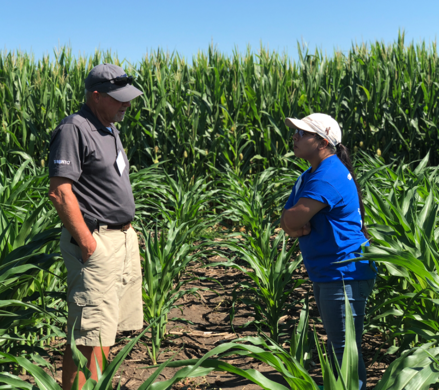
</center>
]

.pull-right[

<center>
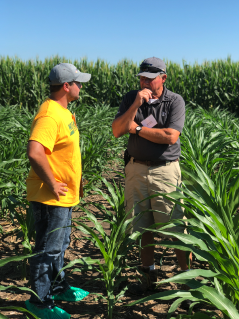
</center>
]

---


## O processo

.pull-left[

### Histórico da área

  - O que foi plantado? 
    
  - O que foi aplicado?
    
  - Carryover?
    
  - Nutricional?
    
  - Plantio?

]

.pull-right[


]

---

## O processo

### Identificando o problema

.pull-left[


<center>
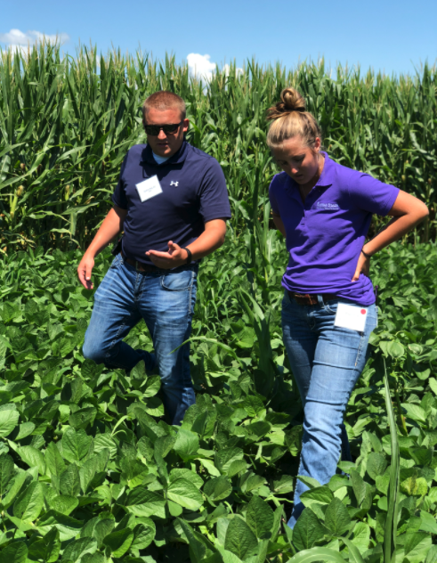
</center>

]

.pull-right[

<center>
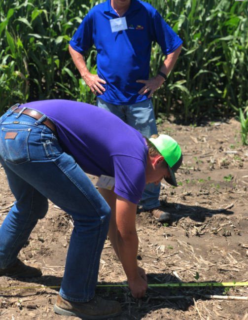
</center>

 
]

---

## O processo

### Identificando o problema


<center>

</center>


---

## O processo

### Existem sintomas?  

.pull-left[

]


.pull-right[

]


---

class: left top
background-image: url(images/manual.png)
background-position: left
background-size: 600px 660px

.pull-right[
## O processo

#### Existem sintomas?  

- [Manual de sintomas](https://maxweeds.rbind.io/pdf/2018-herb-pt.pdf)

- [Manual de hebicidas](https://maxweeds.rbind.io/pdf/2020-classification.pdf)

- Vários outros manuais
]


---

## O processo

### Padrão


<center>

</center>


---

## O processo

### Padrão 

<center>

</center>


---

## O processo

### Padrão 

<center>

</center>

---


## O processo

### Qual o agente causador?


<center>

</center>


---


## O processo


### Faixas?  

.pull-left[

]


.pull-right[

]

---

## Identificando problemas


.pull-left[

- Pergunte qual o problema ou preocupação

- Qualidade de perguntas: lógica e fluência

- Questione sobre a aplicação, ambiente e práticas culturais

- Identifique o problema

- Faça a recomendação
]

.pull-right[

<center>
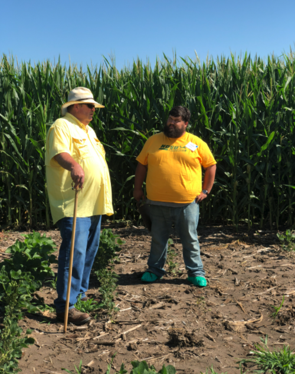
</center>

]


---
background-image: url(images/meso2.png)
background-position: right
background-size: contain

## Um exemplo

- Injúria do herbicida mesotrione <br>(Callisto) na soja

--

- O produtor usou mesotrione no milho

--

- Fez a triplice lavagem do tanque e foi <br>aplicar outros herbicidas na soja

--

- Porém esqueceu de esvaziar e <br>limpar os bicos


---
background-image: url(images/meso1.png)


---

## Identificando problemas

- Nem sempre vai resolver o problema


---

class: inverse 


## Caso de estudo 1

- Um produtor rural plantou soja RR em outubro

--

- Em dezembro, ele teve uma parte da lavoura em que a soja teve injúria severa

--

- Parte da produção está comprometida

--

- Você é o agrônomo responsável pela venda das sementes


---

class: top left
background-image: url(images/dicamba.PNG)
background-position: right
background-size: contain


## Plantas

.pull-left[

- Plantas danificadas próximo a borda da lavoura

<center>

</center>
]


---

## Imagem aérea

<center>

</center>


---

## Problema


- O produtor te ligou querendo que você pague pelo prejuízo 

--

- Ele alega que você entregou sementes de soja RR misturadas com sementes outras sementes de soja convencional

--

- Como você resolveria esse caso?


???

Perguntar se conhecem o a soja Xtend. Nova tecnologia chegando ao Brasil.

---

# Conclusão

- O vizinho aplicou o herbicida dicamba na soja Xtend

--

- O vizinho não respeitou a zona tampão de distanciamento

--

- Ocorreu a deriva de dicamba para a área vizinha


---

class: inverse 


## Caso de estudo 2

- Um produtor rural plantou milho Clearfield (tolerante aos herbicidas inibidores da ALS)

--

- Em uma parte da lavoura o milho morreu

--

- Soja RR foi plantada no ano anterior. Não foi usado ALS na soja, apenas Roundup

--

- Pensou que o milho não Clearfild foi vendido para ele


---

background-image: url(images/problem1.png)
background-position: right

## Plantas

- Área com <br> injúrias


???

Típicas injúria de herbicidas da ALS


---


background-image: url(images/problem2.png)
background-position: left

.pull-right[
## Plantas

- Área com  injúrias

]

---


background-image: url(images/problem3.png)
background-position: right


## Plantas

- Márgens da <br>lavoura


---

## Ponto de início da pulverização

- Injúria gradual do ponto de início

- Sugere injúria de herbicida e não plantio

<center>
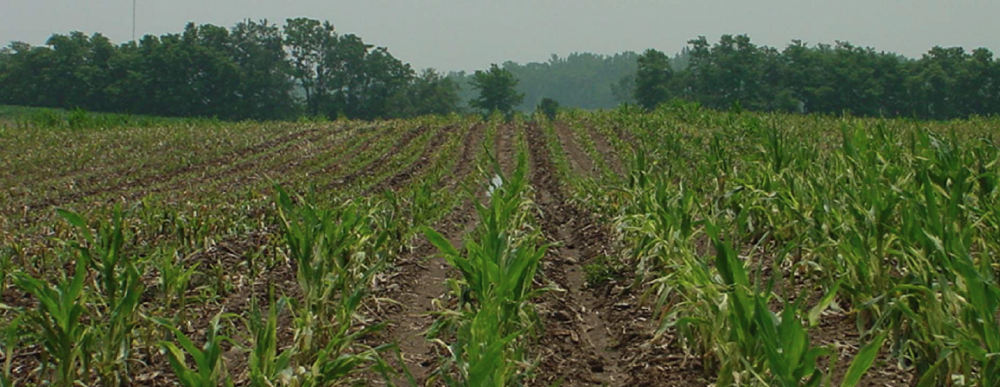
</center>


---

## Formato da injùria

- Várias larguras da plantadeira

<center>
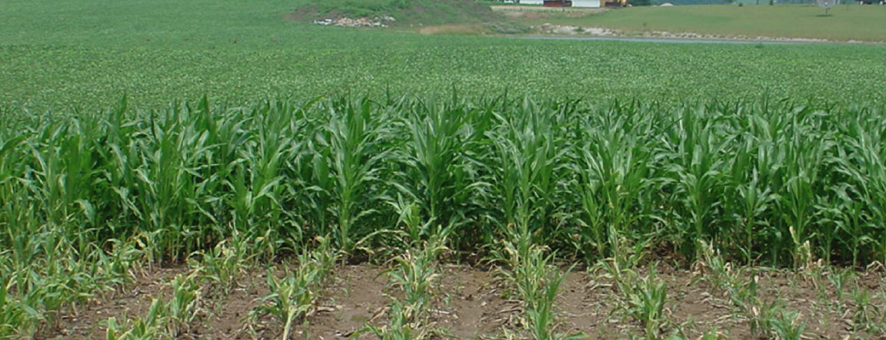
</center>

???

Pergunta porquê formato da injúria é importante.

---

## Formato da injùria

- Angular

<center>
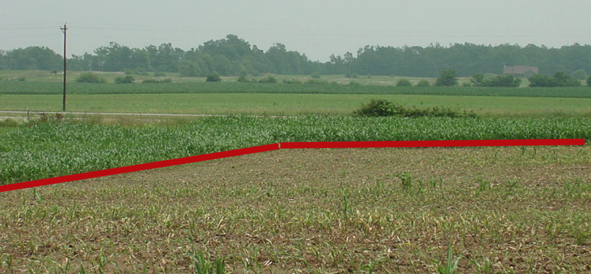
</center>


---

background-image: url(images/problem7.png)
background-position: cover


---


## Início da aplicação

- Aplicação durante o dia

<center>
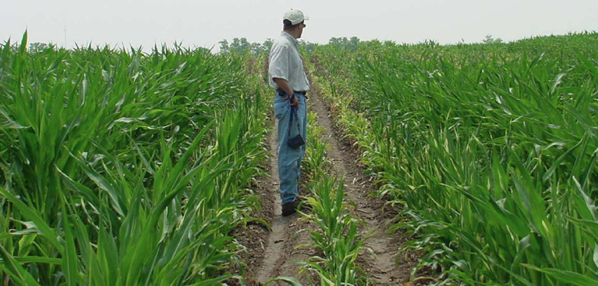
</center>


---


<center>
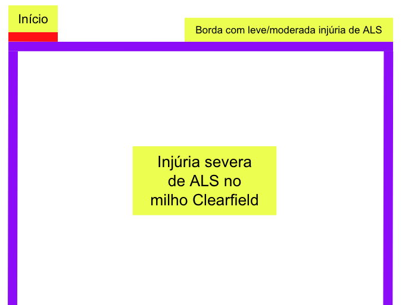
</center>


---

background-image: url(images/problem9.png)
background-position: cover

???

Verificar as plantas daninhas é importante por quê?

---

background-image: url(images/problem10.png)
background-position: cover

---

<center>
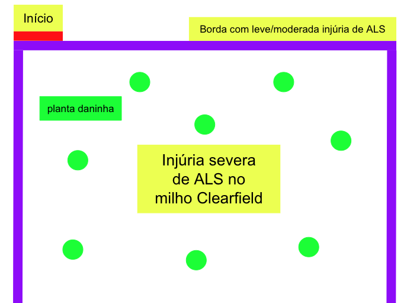
</center>


---


## Resolvendo o problema

- Muitas perguntas

- Análise de plantas

- Contactou a coop local - permitido devido ao fato que teve um processo judicial envolvido

- Contactou as empresas de herbicidas


---

## Conclusão 

- Foi identificado que o controle das plantas daninhas foi pulverizado com **alta dosagem** de Arsenal (imazapyr) na entressafra. 

- A tentativa de controlar e a recomendação errada levou a super dosagem de ALS na área


---

name: goodbye
class: right, middle, blue


# Obrigado!

#### Me encontre no...

[`r icon::fa("twitter")` @maxwelco](http://twitter.com/maxwelco)  
[`r icon::fa("github")` @maxwelco](http://github.com/maxwelco)  
[`r icon::fa("link")` maxweeds.rbind.io/pt/](https://maxweeds.rbind.io/pt/)  
[`r icon::fa("paper-plane")` maxwelco@gmail.com](mailto:maxwelco@gmail.com)

