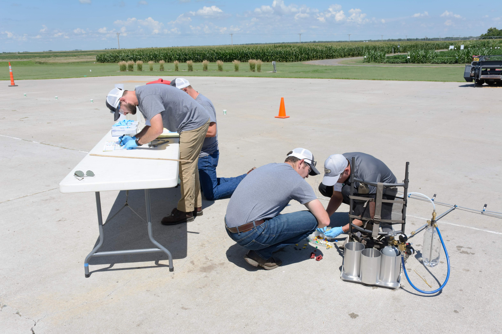

```{r include=FALSE}
library(tidyverse)
library(icons)
```

```{r setup, include=FALSE}
options(htmltools.dir.version = FALSE)
knitr::opts_chunk$set(
  fig.width=9, fig.height=3.5, fig.retina=3,
  out.width = "100%",
  cache = FALSE,
  echo = TRUE,
  message = FALSE, 
  warning = FALSE,
  fig.show = TRUE,
  hiline = TRUE
)
```

```{r xaringan-themer, include=FALSE, warning=FALSE}
library(xaringanthemer)
style_solarized_light()
```

```{r meta, echo=FALSE}
library(metathis)
meta() %>%
  meta_general(
    description = "Oliveira's lecture at the University of Wisconsin-Madison",
    generator = "xaringan and remark.js"
  ) %>% 
  meta_name("github-repo" = "maxwel/talks") %>% 
  meta_social(
    title = "Doing Good at the 2021 Weeds Contest",
    url = "https://contest-talk.netlify.app/",
    image = "images/dandelion.jpeg",
    image_alt = "This an image of a dandelion. One of the most common weed species in the US",
    og_type = "website",
    twitter_card_type = "summary_large_image",
    twitter_creator = "@maxwelco"
    ) %>% 
   include_meta()
```

```{r features, include=FALSE, warning=FALSE}
xaringanExtra::use_search(show_icon = TRUE,
                          position = "top-left")
xaringanExtra::use_webcam()
#xaringanExtra::use_freezeframe()
xaringanExtra::use_tile_view() # use letter O
xaringanExtra::use_share_again()
xaringanExtra::use_scribble() # use letter S
xaringanExtra::use_fit_screen()
xaringanExtra::use_broadcast() # use P
```

class: middle, center

## Maxwel Coura Oliveira


[`r icon_style(fontawesome("github"), style = "solid")` @maxwelco](https://github.com/maxwelco)  
[`r icon_style(fontawesome("twitter"), style = "solid")` @maxwelco](https://twitter.com/maxwelco)  
[`r icon_style(fontawesome("link"), style = "solid")` maxweeds.rbind.io](https://maxweeds.rbind.io)


---
background-image: url(images/juli.jpeg)
background-position: right
background-size: contain

## My experience


- Student

  - 2014
  
  - 2015
  
  - 2016
  
  - 2017
  
- Coach

  - 2018
  
  - 2019


---

## My experience

.pull-left[
<center>
- Ohio State 2015 (Weed Olympics)

</center>
]

.pull-right[

<center>
- Purdue 2016

</center>
]

---

## My experience

<center>
- Iowa State 2017 <br>

</center>

---

## My experience

<center>
- Nebraska 2018 <br>

</center>

---

## The weeds contest

<center>
<iframe width="750" height="500" src="https://www.youtube.com/embed/-5wufijc09g;start=2" frameborder="0" allow="accelerometer; autoplay; encrypted-media; gyroscope; picture-in-picture" allowfullscreen></iframe>
</center>


---

class: center
background-image: url(images/notes.jpeg)
background-position: right
background-size: cover

# Lessons


---

name: yourself

background-image: url(images/happen.jpeg)
background-position: right
background-size: contain

## Lesson # 1


You do not have to do it


---
class: middle, center

## Lesson # 2

Do not worry if you have to do it


<center>

</center>

---
name: yourself

background-image: url(images/yourself.jpeg)
background-position: left
background-size: contain

.pull-right[
## Lesson # 3


The outcome will not define you
]


---
name: yourself

background-image: url(images/skills.jpeg)
background-position: right
background-size: contain

## Lesson # 4

Your skills might not align to weeds contest

---
name: win

background-image: url(images/win.jpeg)
background-position: left
background-size: contain

.pull-right[
## Lesson # 5

Do not be scary to fail


]

---
name: fargo

background-image: url(https://upload.wikimedia.org/wikipedia/pt/4/45/FargoPoster.jpg)
background-position: right
background-size: contain

## Lesson # 6

... and **sometimes** you visited a new place for free


---
name: network

class: center
background-image: url(images/network.jpeg)
background-position: bottom
background-size: contain

## Lesson # 7

... and **always** increased your netwrok

---

class: middle, center

## Lesson # 8

You have nothing to loose

<center>

</center>


---

background-image: url(images/win_6.jpeg)
background-position: left
background-size: contain

.pull-right[
## Lesson # 9

You do not have to win
]
---

background-image: url(images/win_5.jpeg)
background-position: right
background-size: contain


## Lesson # 10

If you win, be humble


---
name: outliers

background-image: url(https://slasherpastor.files.wordpress.com/2016/01/outliers-malcolm-gladwell.jpg)
background-position: left
background-size: contain

.pull-right[
## Lesson # 11


"It takes **10,000 hours** of practice to make you an expert of anything"
]


---
name: velvetleaf

background-image: url(images/velvetleaf.jpeg)
background-position: right
background-size: contain


## Lesson # 12

Weeds are everywhere


---
name: sprayer

background-image: url(images/sprayer.jpeg)
background-position: left
background-size: contain

.pull-right[
## Lesson # 13

Understand what you do at work
]


---

name: training

background-image: url(images/training.jpeg)
background-position: right
background-size: contain


## Lesson # 14

Learn a new thing a day

---
name: farmer

background-image: url(images/farmer.jpeg)
background-position: left
background-size: contain

.pull-right[
## Lesson # 15

Talk to growers
]

---

class: middle, center

## Lesson # 16

Learn from growers, agronomists, consultants ...

<center>

</center>


---
name: reading

background-image: url(images/reading.jpeg)
background-position: right
background-size: contain


## Lesson # 17

Read


---
class: middle, center

## Lesson # 18

Do not read only research papers

<br>

<center>

</center>


---

background-image: url(images/better.jpeg)
background-position: left
background-size: contain

.pull-right[
## Lesson # 19

Study in groups and help others
]

---

background-image: url(images/teach.jpeg)
background-position: right
background-size: contain


##Lesson # 20

Teach

> "By **learning** you will **teach**; by **teaching** you will **learn**"<br> Latin proverb


---

background-image: url(images/chess.jpeg)
background-position: left
background-size: contain

.pull-right[
## Lesson # 21

Reduce your competitiveness
]

---

background-image: url(images/share.jpeg)
background-position: right
background-size: contain


##Lesson # 22

Share your knowledge


---
class: middle, center

## Lesson # 23

Do not burn out

<center>

</center>

---
background-image: url(https://media.giphy.com/media/1hqYk0leUMddBBkAM7/giphy.gif)
background-position: left
background-size: contain

.pull-right[
## Lesson # 24

Enjoy your weekends
]


---

background-image: url(images/mind.jpeg)
background-position: right
background-size: contain


## Lesson # 25

Be aware of your cognitive load


---

background-image: url(https://media.giphy.com/media/UVY3XVI5ipK5BCOgqu/giphy.gif)
background-position: left
background-size: contain

.pull-right[
## Lesson # 26

Set goals
]


---

background-image: url(images/break.jpeg)
background-position: right
background-size: contain


## Lesson # 27

Rest


---

class: middle, center

## Lesson # 28

Better if you like math

<center>

</center>


---

background-image: url(images/flamingo.jpeg)
background-position: left
background-size: contain

.pull-right[
## Lesson # 29

Remember you are unique
]

---


class: middle, center

## Lesson # 30

You have to solve problems

<center>

</center>


---

class: middle, center

## Lesson # 31

You have to assemble things

<center>

</center>


---


class: middle, center

## Lesson # 32

Herbicide ID is not easy

<center>

</center>


---

background-image: url(https://miro.medium.com/max/3990/1*boLqLMqFZlD0n8RWKsMD_A.jpeg)
background-position: right
background-size: contain


## Lesson # 33

Create mental models


---

background-image: url(images/backpack.jpeg)
background-position: left
background-size: contain

.pull-right[
## Lesson # 34

Weeds contest is part of your journey
]

---

background-image: url(images/puzzle.jpeg)
background-position: right
background-size: contain


## Lesson # 35

My lessons will not make you win

---
class: center
background-image: url(images/puzzle_1.jpeg)
background-position: middle
background-size: cover


## Learn from your own lessons


---


background-image: url(images/aeronautics.jpeg)
background-position: right
background-size: contain


## Weeds contest

It is like assembling a balloon


---

background-image: url(images/balloon.jpeg)
background-position: left
background-size: contain

.pull-right[
## Weeds contest

The most important thing is being there
]

---

name: goodbye
class: right, middle, blue


# Thank you!

#### You can find me at...

[`r icon_style(fontawesome("github"), style = "solid")` @maxwelco](https://github.com/maxwelco)  
[`r icon_style(fontawesome("twitter"), style = "solid")` @maxwelco](https://twitter.com/maxwelco)  
[`r icon_style(fontawesome("link"), style = "solid")` maxweeds.rbind.io](https://maxweeds.rbind.io)  
[`r icon_style(fontawesome("envelope-square"), style = "solid")` maxwelco@gmail.com](mailto:maxwelco@gmail.com)
